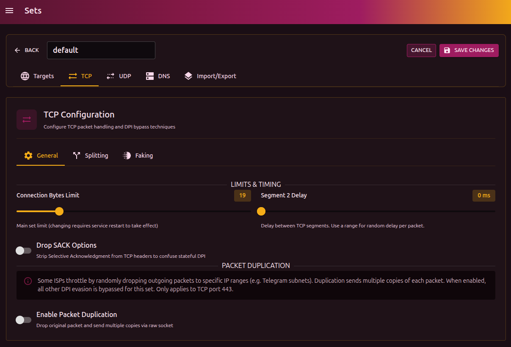

# Наборы конфигураций (Sets)

Наборы конфигураций (Sets) — ключевая функция B4, позволяющая применять разные стратегии обхода DPI для разных доменов и IP-адресов.


## Концепция

Вместо единой глобальной конфигурации B4 позволяет создавать несколько независимых наборов настроек. Каждый набор содержит:

- **Targets** — список доменов и IP, к которым применяется набор
- **TCP** — параметры обработки TCP-соединений, разделения пакетов и фейковых пакетов (3 подвкладки: General, Splitting, Faking)
- **UDP & QUIC** — параметры обработки UDP/QUIC
- **DNS** — настройки DNS-обхода
- **Import/Export** — импорт и экспорт конфигурации

### Зачем нужны разные наборы

Разные сервисы могут требовать разных стратегий обхода:

| Сервис   | Особенности              | Рекомендуемая стратегия      |
| -------- | ------------------------ | ---------------------------- |
| YouTube  | Агрессивный DPI, QUIC    | TCP фрагментация + drop QUIC |
| Discord  | Чувствителен к задержкам | Минимальная фрагментация     |
| Telegram | Блокировка по IP         | GeoIP категории + faking     |
| Торренты | UDP-трафик               | UDP fake mode                |

:::info Дополнительно
Подробнее о том, почему DPI применяется по-разному от сайта к сайту, от провайдера к провайдеру, [можно почитать в отдельной статье](dpi.md).
:::

### Порядок обработки (Matching)

B4 перебирает и сопоставляет наборы **сверху вниз** по списку:

1. Для каждого соединения B4 извлекает домен (из SNI) и/или IP назначения
2. Проверяет каждый набор по порядку
3. Первый набор, чьи цели (`targets`) совпадают — применяется
4. Если ни один не совпал — используется **Main Set**

```plain
Соединение: youtube.com
    ↓
[Set #1: Discord] → targets: discord.com → НЕ совпадает
    ↓
[Set #2: YouTube] → targets: youtube, googlevideo → СОВПАДАЕТ ✓
    ↓
Применяются настройки Set #2
```

:::tip Порядок важен
Размещайте более специфичные наборы выше в списке. Общие наборы (например, `ru-blocked`) — ниже.

Пользуйтесь кнопками перемещения сетов вниз-вверх
:::

## Менеджер наборов

Доступ: **Settings → Sets**

### Интерфейс списка

Каждый набор в списке отображает:

| Элемент           | Описание                                        |
| ----------------- | ----------------------------------------------- |
| **Переключатель** | Включение/отключение набора                     |
| **Номер/MAIN**    | Позиция в порядке обработки                     |
| **Название**      | Имя набора                                      |
| **Счётчик**       | Количество доменов/IP в targets                 |
| **SNI badge**     | Индикатор включённого SNI faking                |
| **Карточки**      | Краткая сводка TCP/UDP настроек                 |

### Действия с наборами

| Действие                   | Описание                     |
| -------------------------- | ---------------------------- |
| **Переместить вверх/вниз** | Изменить приоритет обработки |
| **Дублировать**            | Создать копию набора         |
| **Редактировать**          | Открыть редактор             |
| **Удалить**                | Удалить набор (кроме Main)   |

### Main Set

**Main Set** — особый набор, который:

- Нельзя удалить
- Используется как fallback для трафика без совпадений
- Рекомендуется оставлять с минимальными настройками

## Создание набора

1. Нажмите **Create New Set**
2. Введите название (например, "YouTube Bypass")
3. Настройте параметры во вкладках
4. Нажмите **Save Changes**

Новый набор создаётся с настройками по умолчанию, оптимизированными для большинства случаев.

:::warning Сохранение
Сет, добавленный в список еще не находится в конфигурации сервиса.
Не забудьте применить сохранение вверху страницы после добавления сета!
:::

## Редактор набора

Редактор содержит пять вкладок: **Targets**, **TCP** (с подвкладками General, Splitting, Faking), **UDP & QUIC**, **DNS** и **Import/Export**.

### Targets — Цели

Определяет, к какому трафику применяется набор.

#### Bypass Domains (Домены)

**Manual Domains** — ручной ввод доменов:

```plain
youtube.com
googlevideo.com
```

:::tip Суб домены
Поддомены будут автоматически покрыты, если вы добавите общий домен. То есть совпадение пройдет для поддомена `sub2.sub1.example.com` если в сет вы добавите `example.com`.
:::

**GeoSite Categories** — категории из geosite.dat:

- Выберите категорию из выпадающего списка
- Клик по чипу категории показывает превью доменов
- Отображается количество доменов в категории

#### Bypass IPs (IP-адреса)

**Manual IPs** — ручной ввод IP/CIDR:

```plain
142.250.0.0/16
208.65.153.238
```

Поддерживается:

- Одиночный IP: `1.2.3.4`
- CIDR-диапазон: `10.0.0.0/8`
- Несколько через запятую или пробел

**GeoIP Categories** — категории из geoip.dat:

- Двухбуквенные коды стран: `ru-blocked`, `ru`
- Специальные: `cloudflare`, `google`, `facebook`

:::warning Если отсутствуют поля geodata
Скорее всего у вас не настроены файлы geodata. Настройте их [в настройках сервиса в соотвествующем разделе](settings.md#geodat-settings-настройки-geodat).
:::

---

### TCP — Настройки TCP

TCP-вкладка объединяет все параметры обработки TCP-соединений и техники обхода DPI. Вкладка разделена на **три подвкладки**:

| Подвкладка    | Содержание                                                                             |
| ------------- | -------------------------------------------------------------------------------------- |
| **General**   | Основные параметры: лимиты соединения, задержки, удаление SACK, дупликация пакетов    |
| **Splitting** | Стратегии разделения пакетов (TCP, IP, TLS, OOB фрагментация)                         |
| **Faking**    | Все техники обмана DPI: фейковые пакеты, SYN fake, desync, манипуляция окном, мутация  |


#### Как работает TCP-обработка в B4

Когда B4 перехватывает TCP-пакет, направленный на целевой домен/IP, он может:

1. **Разделить пакет** — фрагментация на уровне TCP, IP или TLS (подвкладка Splitting)
2. **Отправить фейковые пакеты** — SYN, RST, FIN, ACK с низким TTL или битым checksum (подвкладка Faking)
3. **Манипулировать TCP Window** — сбить состояние DPI фейковыми ACK с разными размерами окна (подвкладка Faking)
4. **Применить Desync-атаку** — инжектировать пакеты, ломающие state-tracking DPI (подвкладка Faking)

Все эти техники применяются **только к первым N байтам** соединения (параметр `Connection Bytes Limit`), после чего трафик идёт без вмешательства.

#### General — Основные параметры

| Параметр                   | Что делает                                              | Типичные значения |
| -------------------------- | ------------------------------------------------------- | ----------------- |
| **Connection Bytes Limit** | Сколько первых байт соединения обрабатывать             | `19` / `32`       |
| **Segment 2 Delay**        | Задержка между 1-м и 2-м сегментами (мс)               | `0–100 ms`        |
| **Drop SACK Options**      | Удаляет TCP SACK-опции из заголовка                     | `off`             |
| **Packet Duplication**     | Отправка нескольких копий каждого исходящего TCP-пакета | `off`             |



##### Connection Bytes Limit

B4 применяет `фрагментацию`, `desync` и `фейкинг` **только к первым N байтам** потока. Остальная часть соединения идёт «как есть», без вмешательства. Это:

- снижает нагрузку на CPU
- уменьшает риск странных багов на длинных соединениях

DPI в большинстве случаев анализирует первые десятки байт (`ClientHello`, `SNI` и т.п.), поэтому:

- `19` — минимально агрессивный вариант, хватает для многих DPI;
- `32`–`64` — когда нужно зацепить чуть больше полезных данных.

:::danger Важно

- Значение `Connection Bytes Limit` **в сете** не может быть больше, чем в **MAIN Set**.
  `MAIN` задаёт глобальный верхний предел для всех сетов.
- Изменения параметра в `MAIN` требует **обязательного** рестарта B4.
  :::

##### Segment 2 Delay

Искусственная задержка перед отправкой **второго TCP-сегмента**:

- помогает ломать DPI, который ожидает строгий тайминг (timing);
- слишком большие значения увеличивают задержку соединения.

:::tip совет

- агрессивный обход: `20–80 ms`;
- чувствительные к задержкам сервисы (игры, голос, Discord): `0–10 ms` или вообще `0`.
  :::

##### Drop SACK Options

Selective ACK помогает TCP восстанавливать потерянные пакеты. DPI использует SACK для точной реконструкции потока. Удаление SACK:

- Ломает state-tracking у DPI
- Может немного снизить производительность на линиях с потерями

##### Packet Duplication

При включении B4 отправляет **несколько копий** каждого исходящего TCP-пакета. Это помогает обойти провайдеров, которые случайным образом дропают пакеты к определённым IP-адресам (например, Telegram).

- Создайте отдельный сет с целевыми IP
- Включите Packet Duplication и задайте количество копий (`2–5` обычно достаточно)
- Используется **вместо** остальных техник обхода DPI для этого сета
- Расходует дополнительный трафик пропорционально количеству копий

---

### UDP — Настройки UDP и QUIC

UDP-вкладка управляет обработкой `UDP`-трафика, включая `QUIC`-протокол (HTTP/3). Основная задача — либо заблокировать QUIC для принудительного fallback на TCP, либо применить DPI bypass техники к UDP-пакетам.

#### Как работает UDP-обработка в B4

UDP-обработка состоит из двух этапов:

1. **Matching** — определение, какой UDP-трафик обрабатывать (QUIC, конкретные порты)
2. **Action** — что делать с matched трафиком (drop или fake)

---

#### Этап 1: Какой трафик обрабатывать

| Параметр        | Описание                      | По умолчанию |
| --------------- | ----------------------------- | ------------ |
| **QUIC Filter** | Режим фильтрации QUIC-пакетов | `disabled`   |
| **Port Filter** | Фильтр по destination портам  | пусто        |
| **Filter STUN** | Игнорировать STUN-пакеты      | `true`       |

##### QUIC Filter

QUIC — это сетевой протокол на базе UDP, используемый `YouTube`, `Google`, `Cloudflare` и другими. Многие DPI не умеют анализировать QUIC, поэтому его блокируют целиком.

| Режим        | Описание                                                                |
| ------------ | ----------------------------------------------------------------------- |
| **Disabled** | QUIC не обрабатывается, проходит как есть                               |
| **All**      | Все QUIC Initial пакеты (слепое сопоставление по структуре, все подряд) |
| **Parse**    | Только QUIC с SNI из списка доменов сета (умное сопоставление)          |

:::tip совет

- **Disabled** — используйте, если QUIC не блокируется провайдером
- **All** — агрессивный режим, ловит весь QUIC
- **Parse** — точечный режим, требует настроенных доменов в Targets
  :::

:::warning Parse требует домены
В режиме `Parse` без настроенных доменов в Targets **ничего не будет обработано**. B4 парсит SNI из QUIC ClientHello и сверяет с вашим списком.
:::

##### Port Filter

Фильтрация UDP по destination портам. Формат:

```plain
5000-6000,8000,9000-9100
```

Используйте для:

- VoIP (discord и тп)
- Онлайн-игры (зависит от игры)
- Кастомных UDP-сервисов

Если пусто — фильтрация по портам не производится.

##### Filter STUN

STUN используется для NAT traversal в VoIP и видеозвонках.
:::warning Filter STUN
**Рекомендуется оставить включённым** — обработка STUN может сломать голосовую связь.
:::

---

#### Этап 2: Что делать с выявленым трафиком

Эти настройки появляются только если QUIC Filter ≠ Disabled или задан Port Filter.

| Параметр                     | Описание                                       | По умолчанию |
| ---------------------------- | ---------------------------------------------- | ------------ |
| **Action Mode**              | Режим обработки                                | `fake`       |
| **Connection Packets Limit** | Сколько первых пакетов соединения обрабатывать | `8`          |

##### Action Mode

| Режим    | Что происходит                                           |
| -------- | -------------------------------------------------------- |
| **Drop** | Пакеты дропаются, приложение делает fallback на TCP      |
| **Fake** | Перед реальным пакетом отправляются фейки + фрагментация |

**Drop** — простой и надёжный способ. YouTube, Discord, браузеры автоматически переключаются на HTTPS (TCP) если QUIC недоступен. Минус: теряется преимущество QUIC в скорости.

**Fake** — пытается обойти DPI для UDP. Сложнее, но сохраняет QUIC. Требует настройки фейковых пакетов.

##### Connection Packets Limit

Аналог TCP `Connection Bytes Limit`, но для UDP считается в пакетах, не байтах. B4 обрабатывает только первые N пакетов соединения.

- `5–8` — рекомендуемое значение
- `1–3` — минимальная нагрузка, но может не хватить для пробития

:::danger Важно

- Значение `Connection Bytes Limit` **в сете** не может быть больше, чем в **MAIN Set**.  
  `MAIN` задаёт глобальный верхний предел для всех сетов.
- Изменения параметра в `MAIN` требует **обязательного** рестарта B4.
  :::

---

#### Настройки Fake Mode

Появляются только при `Action Mode = Fake`.

| Параметр              | Описание                                 | По умолчанию |
| --------------------- | ---------------------------------------- | ------------ |
| **Faking Strategy**   | Как сделать фейковые пакеты невалидными  | `none`       |
| **Fake Packet Count** | Количество фейков перед реальным пакетом | `6`          |
| **Fake Packet Size**  | Размер payload фейкового пакета          | `64`         |
| **Segment 2 Delay**   | Задержка между сегментами (мс)           | `0`          |

##### Faking Strategy

| Стратегия    | Описание                                     |
| ------------ | -------------------------------------------- |
| **None**     | Без стратегии (фейки могут дойти до сервера) |
| **TTL**      | Низкий TTL — пакеты «умирают» до сервера     |
| **Checksum** | Битый UDP checksum — сервер отбросит         |

- **TTL** — безопаснее, работает везде
- **Checksum** — эффективнее против некоторых DPI, но может фильтроваться на пути

:::tip Рекомендация
Начните с `TTL`. Если не помогает — попробуйте `Checksum`.
:::

##### Fake Packet Count

Количество фейковых пакетов, отправляемых **перед** каждым реальным пакетом.

- `3–6` — базовый уровень
- `10–20` — агрессивный режим (больше нагрузки)

##### Fake Packet Size

Размер payload фейкового UDP-пакета в байтах.

- `64` — небольшие пакеты, меньше нагрузки
- `256–512` — имитация реального трафика
- `1200–1400` — близко к MTU, максимальная имитация

##### UDP: Segment 2 Delay

Задержка между фрагментами/сегментами в миллисекундах. Ломает timing-based DPI.

- `0` — без задержки
- `10–50 ms` — лёгкий desync
- `100+ ms` — заметно влияет на latency

---

#### Типичные сценарии

| Сценарий                       | Рекомендуемые настройки                             |
| ------------------------------ | --------------------------------------------------- |
| YouTube блокируется через QUIC | QUIC Filter: `All`, Mode: `Drop`                    |
| YouTube + сохранить QUIC       | QUIC Filter: `Parse`, Mode: `Fake`, Strategy: `TTL` |
| Discord голос лагает           | Filter STUN: `On`, низкий Seg2 Delay                |
| Gaming UDP заблокирован        | Port Filter: `порты игры`, Mode: `Fake`             |
| Ничего не блокируется          | QUIC Filter: `Disabled`                             |

:::info Почему Drop часто лучше Fake
UDP bypass сложнее TCP — нет handshake, нет retransmit. Если `Fake` не работает стабильно, `Drop` + fallback на TCP — надёжнее.
:::

---

#### Splitting — Стратегия разделения пакетов

:::info Расположение в интерфейсе
Эти настройки находятся во вкладке **TCP → Splitting**. Ранее они были в отдельной вкладке «Fragmentation».
:::

Разделение пакетов — ключевая техника обхода DPI. Идея простая: DPI анализирует пакеты целиком, ожидая увидеть `ClientHello` с `SNI` в одном пакете. Если разбить пакет так, чтобы SNI оказался разрезан между фрагментами — DPI не сможет его прочитать, а сервер соберёт пакет обратно.

##### Как DPI видит трафик

```text
Обычный пакет:
┌─────────────────────────────────────────────────┐
│ IP Header │ TCP Header │ TLS ClientHello + SNI │
└─────────────────────────────────────────────────┘
                              ↑
                         DPI читает SNI
```

```text
После фрагментации:
┌─────────────────────────────┐  ┌─────────────────────────┐
│ IP │ TCP │ TLS... │ "yout"  │  │ IP │ TCP │ "ube.com"    │
└─────────────────────────────┘  └─────────────────────────┘
                 ↑                           ↑
            DPI видит                   DPI видит
            часть SNI                   часть SNI

         → Не может сопоставить с черным списком
```

---

##### Выбор стратегии

| Стратегия             | Уровень разреза | Совместимость | Эффективность |
| --------------------- | --------------- | ------------- | ------------- |
| **TCP Segmentation**  | TCP             | Высокая       | Высокая       |
| **IP Fragmentation**  | IP              | Средняя       | Высокая       |
| **TLS Record Split**  | TLS             | Высокая       | Очень высокая |
| **OOB (Out-of-Band)** | TCP + URG       | Средняя       | Высокая       |
| **None**              | —               | —             | Только faking |

##### TCP Segmentation

Разбивает данные на уровне TCP. Один TCP-пакет превращается в 2–3 TCP-сегмента с разными порядковыми номерами.

**Как работает:**

```text
Оригинал: [IP][TCP seq=1000][ClientHello...youtube.com...]

После split (позиция 5 в SNI):
Сегмент 1: [IP][TCP seq=1000][ClientHello...yout]
Сегмент 2: [IP][TCP seq=1004][ube.com...]
```

**Плюсы:**

- Работает через NAT и файрволы
- Не требует особой поддержки от сети
- Сервер гарантированно соберёт данные

**Минусы:**

- Некоторые продвинутые DPI умеют пересобирать пакеты TCP

##### IP Fragmentation

Разбивает на уровне IP-протокола. Использует механизм IP fragmentation.

**Как работает:**

```text
Оригинал: [IP total=500][TCP][Payload]

После fragmentation:
Фрагмент 1: [IP MF=1 offset=0][TCP][Payload часть 1]
Фрагмент 2: [IP MF=0 offset=X][Payload часть 2]
```

**Плюсы:**

- Обходит DPI, который работает только на TCP-уровне
- Эффективен против простых DPI

**Минусы:**

- Некоторые сети/NAT дропают фрагментированные пакеты
- Строгие MTU-лимиты могут вызвать проблемы
- Требует правильного выравнивания по 8 байт

##### TLS Record Splitting

Разбивает один TLS record на два отдельных TLS record. Это происходит **внутри** TLS-протокола, не затрагивая TCP/IP.

**Как работает:**

```text
Оригинал:
[TLS Record: type=0x16, len=500][ClientHello data...]

После split:
[TLS Record: type=0x16, len=50][ClientHello начало...]
[TLS Record: type=0x16, len=450][...продолжение с SNI...]
```

**Плюсы:**

- Очень эффективен — многие DPI ожидают ClientHello в одном record
- Полностью валидный TLS — сервер обязан поддерживать
- Не зависит от сетевой инфраструктуры

**Минусы:**

- Работает только для TLS handshake
- Некоторые broken middleboxes могут не понять

##### OOB (Out-of-Band)

Инжектирует байт с TCP URG (Urgent) флагом. Сервер читает URG-данные отдельно от основного потока и игнорирует, а DPI видит «мусор» посреди SNI.

**Как работает:**

```text
Оригинал: [TCP][youtube.com]

После OOB injection (позиция 4, символ 'x'):
Сегмент 1: [TCP URG=1 urgent_ptr=5][youtx]  ← 'x' = OOB байт
Сегмент 2: [TCP][ube.com]

DPI видит: "youtx" + "ube.com" = "youtxube.com" ← не матчит
Сервер видит: "yout" + "ube.com" = "youtube.com" ← OOB байт отброшен
```

**Плюсы:**

- Очень эффективен против гос DPI
- Работает на уровне TCP-протокола

**Минусы:**

- Старые middleboxes могут некорректно обрабатывать URG
- Некоторые серверы неправильно реализуют OOB

##### None

Фрагментация отключена. Пакеты отправляются как есть. Используйте, если полагаетесь только на Faking (фейковые пакеты).

---

##### Общие параметры

| Параметр                   | Описание                               | Применимость      |
| -------------------------- | -------------------------------------- | ----------------- |
| **Reverse Fragment Order** | Отправить фрагменты в обратном порядке | TCP, IP, TLS, OOB |

##### Reverse Fragment Order

По умолчанию фрагменты отправляются в прямом порядке: сначала начало, потом конец. При включении **Reverse Fragment Order**:

```text
Прямой порядок:    Сегмент 1 → Сегмент 2 → Сегмент 3
Обратный порядок:  Сегмент 2 → Сегмент 1 → Сегмент 3
```

**Зачем:**

- DPI часто буферизует первый пакет и ждёт следующие
- Если первым придёт «середина» — DPI может сбросить состояние
- TCP гарантирует сборку в правильном порядке по sequence number

:::tip Рекомендация
Включите Reverse Fragment Order по умолчанию. Это увеличивает шансы обхода без побочных эффектов.
:::

---

##### Параметры TCP/IP стратегий

Эти параметры появляются при выборе **TCP Segmentation** или **IP Fragmentation**.

| Параметр               | Описание                                | По умолчанию |
| ---------------------- | --------------------------------------- | ------------ |
| **SNI Split Position** | Позиция разреза относительно начала SNI | `1`          |
| **Middle SNI**         | Резать посередине SNI автоматически     | `true`       |

##### SNI Split Position

Определяет, на какой позиции **от начала SNI** делать разрез.

```text
SNI: youtube.com (11 символов)
     ^
     позиция 0

SNI Position = 1:  y|outube.com     → "y" + "outube.com"
SNI Position = 3:  you|tube.com     → "you" + "tube.com"
SNI Position = 6:  youtub|e.com     → "youtub" + "e.com"
```

- `0` — резать перед первым символом SNI
- `1–3` — резать в начале SNI
- Большие значения — резать ближе к концу

##### Middle SNI

Если включено, B4 **автоматически** находит SNI в ClientHello и режет посередине, игнорируя `SNI Split Position`.

**Когда использовать:**

- **Middle SNI = On** — универсальный вариант, работает для любых доменов
- **Middle SNI = Off** — если нужен точный контроль через `SNI Split Position`

:::info Приоритет
Если `Middle SNI` включён, `SNI Split Position` используется как fallback, если SNI не найден в пакете.
:::

---

##### Параметры OOB стратегии

Появляются при выборе **OOB (Out-of-Band)**.

| Параметр          | Описание                              | По умолчанию |
| ----------------- | ------------------------------------- | ------------ |
| **OOB Position**  | Позиция инжекции OOB-байта (в байтах) | `1`          |
| **OOB Character** | Символ для OOB-данных                 | `x`          |

##### OOB Position

Определяет, после скольких байт payload вставить OOB-байт.

```text
Payload: [ClientHello...youtube.com...]
          ^
          позиция 0

OOB Position = 1:  [C][OOB][lientHello...youtube.com...]
OOB Position = 50: [ClientHello...yout][OOB][ube.com...]
```

##### OOB Character

Байт, который будет отправлен с URG-флагом. Сервер его отбросит, но DPI увидит.

- По умолчанию: `x` (0x78)
- Можно использовать любой символ
- Не влияет на эффективность bypass — важен сам факт URG-флага

---

##### Параметры TLS стратегии

Появляются при выборе **TLS Record Splitting**.

| Параметр                      | Описание                                  | По умолчанию |
| ----------------------------- | ----------------------------------------- | ------------ |
| **TLS Record Split Position** | Позиция разреза внутри TLS record (байты) | `1`          |

##### TLS Record Split Position

Определяет, после скольких байт **данных handshake** разрезать TLS record.

```text
TLS Record: [Header 5 байт][Handshake data N байт]
                            ^
                            позиция 0

Split Position = 1:
  Record 1: [Header][1 байт]
  Record 2: [Header][остальные N-1 байт]

Split Position = 50:
  Record 1: [Header][50 байт — начало ClientHello]
  Record 2: [Header][остальное — включая SNI]
```

**Рекомендации:**

- `1–10` — агрессивный split в начале handshake
- `50–100` — split ближе к SNI (зависит от размера ClientHello)
- Слишком большое значение автоматически корректируется до `recordLen / 2`

---

##### Рекомендации по выбору

| Ситуация                        | Рекомендуемая стратегия                   |
| ------------------------------- | ----------------------------------------- |
| Не знаю, что выбрать            | TCP + Middle SNI + Reverse                |
| TCP не помогает                 | TLS Record Split                          |
| Блокировка через простой DPI    | IP Fragmentation                          |
| Продвинутый stateful DPI (ТСПУ) | OOB или TLS + Desync (подвкладка Faking)  |
| Максимальная совместимость      | TCP Segmentation                          |
| Полагаюсь только на faking      | None                                      |

:::tip Комбинируйте с Faking
Splitting эффективнее в связке с Faking (подвкладка TCP → Faking). Фейковые пакеты сбивают state DPI, разделение скрывает SNI.
:::

---

#### Faking — Фейковые пакеты и обход DPI

:::info Расположение в интерфейсе
Эти настройки находятся во вкладке **TCP → Faking**. Ранее часть из них была в отдельной вкладке «Faking», а часть — в основной вкладке TCP.
:::

Faking — это техника отправки **поддельных пакетов** перед настоящими. DPI видит фейк, пытается его обработать, сбивается с толку — а настоящий пакет проходит незамеченным.

Подвкладка Faking содержит шесть сворачиваемых секций. Каждая секция показывает свой текущий статус (включена/выключена) без необходимости её раскрывать:

1. **Fake SNI Packets** — отправка фейковых пакетов с поддельным `ClientHello`
2. **SYN Fake Packets** — фейковые SYN-пакеты при TCP-рукопожатии
3. **TCP Desync Attack** — инжекция фейковых RST/FIN/ACK для сбоя state-tracking DPI
4. **Window Manipulation** — фейковые ACK с манипулированным размером TCP-окна
5. **Incoming Response Bypass** — обработка ответов сервера для обхода блокировки загрузок
6. **ClientHello Mutation** — модификация структуры настоящего `ClientHello`

<!-- TODO: обновить скриншот Faking подвкладки с аккордеонами -->

---

##### Концепция: как работают фейковые пакеты

```text
Без faking:
Клиент ──[ClientHello: youtube.com]──→ DPI ──→ Сервер
                                        ↓
                                   Блокировка!

С faking:
Клиент ──[Фейк: мусор]──→ DPI (сбит с толку)
       ──[Настоящий]────→ DPI (пропускает) ──→ Сервер
```

**Ключевой трюк:** фейковые пакеты специально делаются **невалидными** — с низким TTL, битым checksum или неправильным sequence number. Это гарантирует:

- DPI увидит фейк и попытается его обработать
- Фейк **не дойдёт** до сервера (или сервер его отбросит)
- Настоящий пакет дойдёт без проблем

---

##### Fake SNI Packets

Управляет отправкой фейковых пакетов с поддельным `TLS ClientHello`.

| Параметр              | Описание                                  | По умолчанию |
| --------------------- | ----------------------------------------- | ------------ |
| **Enable Fake SNI**   | Включить отправку фейковых SNI-пакетов    | `true`       |
| **Fake Strategy**     | Как сделать фейк невалидным для сервера   | `pastseq`    |
| **Fake Payload Type** | Содержимое фейкового пакета               | `Default`    |
| **Fake TTL**          | Time-To-Live для фейковых пакетов         | `8`          |
| **Sequence Offset**   | Смещение TCP sequence number              | `10000`      |
| **Fake Packet Count** | Количество фейков перед настоящим пакетом | `1`          |

##### Enable Fake SNI

Главный переключатель. При включении B4 отправляет фейковые пакеты **перед** каждым настоящим `ClientHello`.

- **Включено** — фейки отправляются согласно настройкам ниже
- **Выключено** — только фрагментация (если настроена), без фейков

---

##### Fake Strategy

Определяет, **как** сделать фейковый пакет невалидным. Сервер должен его отбросить, а DPI — обработать.

| Стратегия           | Как работает                                       | Надёжность |
| ------------------- | -------------------------------------------------- | ---------- |
| **TTL**             | Низкий TTL — пакет «умирает» не дойдя до сервера   | Высокая    |
| **Past Sequence**   | Sequence number в прошлом — сервер игнорирует      | Высокая    |
| **Random Sequence** | Случайный sequence — сервер не может собрать поток | Средняя    |
| **TCP Checksum**    | Битый TCP checksum — сервер отбрасывает            | Средняя    |
| **MD5 Sum**         | Неверная MD5 подпись (для TCP-MD5)                 | Низкая     |

##### TTL (Time-To-Live)

Каждый IP-пакет имеет счётчик TTL. При прохождении через каждый роутер TTL уменьшается на 1. Когда TTL = 0, пакет уничтожается.

```text
TTL = 8:
Клиент → Роутер1 → Роутер2 → ... → DPI → [TTL=0, пакет умер] ✗ Сервер
                                    ↑
                              DPI увидел фейк
```

**Значение TTL** должно быть достаточным, чтобы дойти до DPI, но недостаточным для сервера:

- `3–5` — для близких DPI (1–2 хопа от вас)
- `8–12` — универсальное значение
- `15–20` — если DPI далеко

:::tip Как подобрать TTL
Используйте `traceroute` до заблокированного сайта. Если DPI срабатывает на 5-м хопе, TTL = 6–8 будет оптимальным.
:::

##### Past Sequence

TCP использует sequence numbers для сборки данных в правильном порядке. Если пакет приходит с sequence **меньше** уже полученного — сервер его игнорирует как «устаревший».

```text
Текущий sequence: 1000

Фейк с Past Sequence (offset=10000):
sequence = 1000 - 10000 = не валидно (в прошлом)

Сервер: "Этот пакет уже был, игнорирую"
DPI: "О, ClientHello! Анализирую..."
```

##### Random Sequence

Отправляет фейк со случайным sequence number далеко в будущем. Сервер не сможет вставить его в поток данных.

##### TCP Checksum

Намеренно портит TCP checksum. Сервер проверяет checksum и отбрасывает пакет, но многие DPI не проверяют checksum для экономии ресурсов.

##### MD5 Sum

Для соединений с TCP-MD5 (редко используется). Неверная MD5 подпись приводит к отбрасыванию пакета.

---

##### Fake Payload Type

Определяет **содержимое** фейкового пакета — что именно увидит DPI.

| Тип         | Содержимое                                                            |
| ----------- | --------------------------------------------------------------------- |
| **Default** | Предзаготовленный ClientHello с фейковым SNI (внутрненний payload B4) |
| **Random**  | Случайные байты (мусор)                                               |
| **Custom**  | Ваш payload в hex-формате                                             |

##### Default

B4 отправляет валидно выглядящий TLS ClientHello с фейковым доменом. DPI думает, что это реальное соединение к безобидному сайту.

##### Random

Случайные байты. Некоторые DPI при виде мусора сбрасывают состояние соединения.

##### Custom

Позволяет задать **свой payload** в hex-формате. Используйте функцию `Capture` для захвата реальных ClientHello.

```text
Пример hex: 160301020001000...
```

:::info Когда использовать Custom
Если Default и Random не работают, попробуйте захватить реальный ClientHello к любому доступному сайту через `Capture`, и использовать как `Custom payload`.
:::

---

##### Fake TTL

Time-To-Live для фейковых пакетов. Используется только при **Strategy = TTL**.

- `1–3` — очень агрессивно, фейк умрёт близко к вам
- `5–10` — стандартный диапазон
- `15–30` — если DPI находится далеко

:::warning внимание
Слишком низкий `TTL` — фейк не дойдёт до DPI.
Слишком высокий `TTL` — фейк дойдёт до сервера и вызовет ошибку в соединении.
:::

---

##### Sequence Offset

Смещение TCP sequence number для стратегий **Past Sequence** и **Random Sequence**.

Для **Past Sequence:**

```text
Реальный seq: 50000
Offset: 10000
Фейковый seq: 50000 - 10000 = 40000 (в прошлом)
```

Для **Random Sequence:**

```text
Реальный seq: 50000
Offset: 10000
Фейковый seq: 50000 + 10000 + random = далеко в будущем
```

:::tip Рекомендуемые значения

- `10000` — стандартное значение
- `50000–100000` — если DPI отслеживает близкие sequence numbers
  :::

---

##### Faking Packet Count

Сколько фейковых пакетов отправить перед **каждым** настоящим пакетом.

```text
Count = 1:  [Фейк] → [Настоящий]
Count = 3:  [Фейк1] → [Фейк2] → [Фейк3] → [Настоящий]
```

- `1` — минимальная нагрузка, достаточно для большинства DPI
- `3–5` — если один фейк не помогает
- `10–20` — агрессивный режим (больше трафика)

:::warning Нагрузка
Каждый фейк — это дополнительный пакет. `Count = 10` означает 10x больше пакетов на handshake. Используйте минимально необходимое значение, по возможности
:::

---

##### SYN Fake Packets

При включении B4 отправляет фейковые SYN-пакеты рядом с реальным TCP-рукопожатием. Фейки используют низкий TTL (не дойдут до сервера) и битый checksum или смещённый sequence number.

| Параметр                    | Что делает                                                                       |
| --------------------------- | -------------------------------------------------------------------------------- |
| **SYN Fake Packets**        | Включает отправку фейковых SYN-пакетов во время TCP-рукопожатия                 |
| **SYN Fake Payload Length** | Длина payload в фейковом SYN (0 = только заголовок, >0 = псевдо-TLS)            |
| **SYN Fake TTL**            | TTL для фейковых SYN-пакетов                                                    |
| **TCP MD5 Signature**       | Добавляет невалидную MD5-подпись в фейковые пакеты                               |

`SYN Fake Payload Length`:

- `0` — только TCP-заголовок
- `>0` — добавляется payload, имитирующий начало TLS ClientHello

:::warning Агрессивная техника
Если сервис начинает работать нестабильно (reset, таймауты) — отключите SYN Fake первым делом.
:::

---

##### TCP Desync Attack

Desync-атака инжектирует фейковые TCP control-пакеты (RST/FIN/ACK) с **битым checksum** и **низким TTL**. Пакеты ломают state-tracking DPI, но отбрасываются реальным сервером.

| Параметр              | Описание                             | По умолчанию |
| --------------------- | ------------------------------------ | ------------ |
| **Desync Mode**       | Тип атаки                            | `off`        |
| **Desync TTL**        | TTL для фейковых пакетов             | `3`          |
| **Desync Count**      | Количество фейковых пакетов за атаку | `3`          |
| **Post-ClientHello RST** | Фейковый RST после ClientHello    | `off`        |

Режимы Desync:

| Режим     | Что отправляется                                  |
| --------- | ------------------------------------------------- |
| **off**   | Desync отключён                                   |
| **rst**   | Фейковые RST с разными sequence number            |
| **fin**   | Фейковые FIN+ACK с прошлыми sequence              |
| **ack**   | Фейковые ACK с рандомными future seq/ack          |
| **combo** | RST + FIN + ACK последовательно                   |
| **full**  | Полная атака: fake SYN, overlapping RST, PSH, URG |

**Desync TTL:** Низкий TTL гарантирует, что пакеты «умрут» до сервера, но пройдут через DPI-узел провайдера. `1–3` для близких DPI-узлов, `5–8` если не знаете топологию.

:::tip Когда использовать
Desync эффективен против stateful DPI (ТСПУ). Начните с `combo` и TTL `3–5`. Если не помогает — попробуйте `full`.
:::

---

##### Window Manipulation

B4 отправляет **фейковые ACK-пакеты** с изменённым размером TCP-окна перед реальным пакетом. Цель — сбить DPI, отслеживающий состояние окна.

| Режим         | Описание                                              |
| ------------- | ----------------------------------------------------- |
| **Disabled**  | Без манипуляции окном                                 |
| **Zero**      | Сначала ACK с `window=0`, затем с `window=65535`      |
| **Random**    | Случайные значения из списка                          |
| **Oscillate** | Перебор значений по порядку                           |
| **Escalate**  | Рост: `0 → 100 → 500 → 1460 → 8192 → 32768 → 65535` |

Все фейковые пакеты отправляются с низким TTL — они **не доходят до сервера**, только до DPI-узла.

Для режимов **Random** и **Oscillate** используется кастомный список значений окна. По умолчанию: `0, 1460, 8192, 65535`.

---

##### Incoming Response Bypass

Обработка **входящих** пакетов от сервера. Эта техника помогает обойти DPI-системы (например, ТСПУ), которые блокируют **загрузку** данных — соединение устанавливается нормально, но обрывается после ~15–20 КБ скачанных данных.

| Параметр          | Описание                                           | По умолчанию |
| ----------------- | -------------------------------------------------- | ------------ |
| **Incoming Mode** | Режим обработки входящих пакетов                   | `disabled`   |
| **Strategy**      | Стратегия для фейковых пакетов (TTL, checksum)     | `ttl`        |
| **Fake TTL**      | TTL для фейковых пакетов к серверу                 | `8`          |
| **Fake Count**    | Количество фейковых пакетов                        | `3`          |
| **Threshold Min** | Минимум байт до начала обработки                   | `0`          |
| **Threshold Max** | Максимум байт, после которых обработка прекращается | `0`          |

Режимы:

| Режим        | Описание                                                    |
| ------------ | ----------------------------------------------------------- |
| **Disabled** | Входящие пакеты не обрабатываются                           |
| **Fake**     | Инжекция фейковых пакетов в направлении сервера             |
| **Corrupt**  | Модификация входящих пакетов для сбоя анализа DPI           |

:::tip Рекомендация
Если загрузки обрываются после ~15 КБ (типичное поведение ТСПУ), включите Incoming Mode = `Fake` со стратегией `TTL`.
:::

---

##### ClientHello Mutation

Мутация изменяет **структуру настоящего ClientHello**, делая его непохожим на стандартный. DPI использует сигнатуры для распознавания TLS — мутация призвана ломать эти сигнатуры.

##### Да что вообще такое этот ваш ClientHello

При установке TLS-соединения клиент отправляет `ClientHello` — сообщение со списком поддерживаемых шифров, расширений и **SNI** (имя сервера). DPI анализирует эту структуру.

```text
Стандартный ClientHello:
┌─────────────────────────────────────────────────────┐
│ Version │ Random │ Ciphers │ Extensions...          │
│                             ├─ SNI: youtube.com     │
│                             ├─ ALPN: h2, http/1.1   │
│                             └─ Supported Groups     │
└─────────────────────────────────────────────────────┘
```

Мутация добавляет/изменяет расширения, делая ClientHello «странным» для DPI, но все еще валидным для сервера.

---

##### Mutation Mode

| Режим               | Что делает                                      |
| ------------------- | ----------------------------------------------- |
| **Disabled**        | Без мутации                                     |
| **Random**          | Перемешивает порядок расширений + добавляет шум |
| **GREASE**          | Вставляет GREASE-расширения                     |
| **Padding**         | Добавляет padding для изменения размера         |
| **Fake Extensions** | Вставляет неизвестные TLS-расширения            |
| **Fake SNIs**       | Добавляет дополнительные фейковые SNI           |
| **Advanced**        | Комбинирует все техники                         |

---

##### Mutation: Disabled

Мутация отключена. `ClientHello` отправляется как есть (но может быть фрагментирован).

##### Mutation: Random

Перемешивает порядок TLS-расширений в случайном порядке.

```text
До:  [SNI][ALPN][Groups][Versions]
После: [Groups][SNI][Versions][ALPN]
```

DPI часто ожидает расширения в определённом порядке. Перемешивание ломает эти ожидания.

##### Mutation: GREASE (Generate Random Extensions And Sustain Extensibility)

`GREASE` — это специальные «мусорные» значения, зарезервированные в `TLS` для тестирования совместимости. Сервер обязан их игнорировать, но DPI может на них споткнуться.

```text
GREASE-расширения: 0x0a0a, 0x1a1a, 0x2a2a, 0x3a3a...

ClientHello с GREASE:
[SNI][GREASE: 0x2a2a][ALPN][GREASE: 0x7a7a][Groups]
```

**GREASE Extension Count** — сколько GREASE-расширений добавить:

- `1–3` — минимальное воздействие
- `5–10` — агрессивный режим

##### Padding

Добавляет TLS Padding Extension для увеличения размера `ClientHello`.

```text
Без padding: ClientHello = 300 байт
С padding (2048): ClientHello = 2048 байт
```

**Зачем:**

- DPI может иметь ограничения на размер буфера
- Большой ClientHello может не поместиться в один пакет
- Меняет fingerprint соединения

**Padding Size** — целевой размер в байтах:

- `256–512` — небольшое увеличение
- `1024–2048` — значительное изменение размера
- `4096–16384` — максимальный padding

##### Fake Extensions

Вставляет несуществующие или редко используемые TLS-расширения со случайными данными.

```text
Реальные расширения: SNI (0x0000), ALPN (0x0010)
Fake Extensions: 0x00ff, 0x1234, 0x5678, 0xfe00...
```

Сервер игнорирует неизвестные расширения (по спецификации TLS), но DPI может не знать, как их обрабатывать.

**Fake Extension Count** — количество фейковых расширений:

- `3–5` — стандартное значение
- `10–15` — агрессивный режим

##### Fake SNIs

Добавляет **дополнительные** SNI-записи в ClientHello. По стандарту SNI должен быть один, но B4 добавляет несколько.

```text
Обычный ClientHello:
  SNI: youtube.com

С Fake SNIs [ya.ru, vk.com]:
  SNI: youtube.com
  SNI: ya.ru      ← фейк
  SNI: vk.com     ← фейк
```

DPI может:

- Взять первый SNI (настоящий)
- Взять последний SNI (фейковый)
- Запутаться и пропустить

**Добавление Fake SNI:**

1. Введите домен в поле "Add Fake SNI"
2. Нажмите Enter или кнопку +
3. Домен появится в списке чипов

**Рекомендуемые фейковые домены:**

- Популярные незаблокированные сайты: `ya.ru`, `vk.com`, `mail.ru`
- Государственные сайты: `gosuslugi.ru`, `kremlin.ru`
- Сайты самого провайдера

##### Advanced (All)

Комбинирует **все** техники мутации:

1. Добавляет Fake SNIs
2. Добавляет стандартные TLS-расширения (supported_groups, signature_algorithms, supported_versions)
3. Добавляет TLS 1.3 расширения (psk_key_exchange_modes, key_share, status_request)
4. Добавляет GREASE
5. Добавляет Fake ALPN с множеством протоколов
6. Добавляет Fake Extensions
7. Перемешивает всё
8. Добавляет Padding

**Используйте Advanced**, если отдельные режимы не помогают. Это максимально агрессивная мутация.

:::warning Размер пакета
Advanced-мутация значительно увеличивает размер ClientHello. Если пакет превышает MTU (~1460 байт), B4 автоматически урезает мутации.
:::
